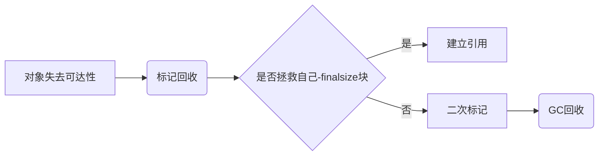
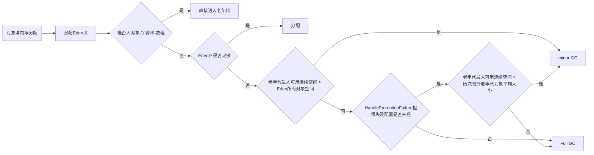
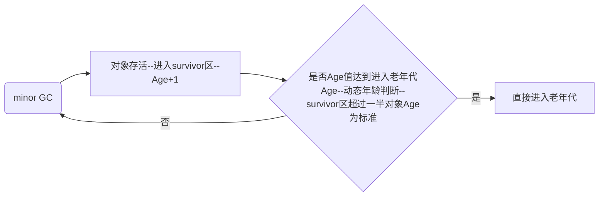

## 前言
JVM不仅承担Java字节码的分析和执行，同时也内置了自动内存分配管理机制。我们在Java开发过程中，有时过度依赖于JVM内存管理自动化，弱化对内存的管理，这样系统很容易发生JVM异常。所以我们需要深入了解JVM内存分配和回收原理，这样在遇到问题时才能通过日志分析快速定位问题。

### java内存管理

**运行时数据区域**
java虚拟机在程序运行中会将内存划分为不同的数据区域，这些区域有着不同的用处和不同的生存时间

- 程序计数器：每条**线程独立存储且私有**的区域，用于记录程序执行中所处于虚拟机**字节码指令地址**（多线程切换CPU时间片也会需要保存下一条指令），如果执行的是本地native方法，这个值为空，这个区域**不会发生outOfMemoryError**

- Java虚拟机栈：和Java线程一起创建，线程私有用于存储**java方法**执行时的**局部变量表，操作数栈，动态链接，方法出口等信息**，在这个区域栈深度如果大于jvm设置的栈深度，会抛出StackOverflowError，如果通过动态扩展申请不到足够内存，会发生outOfMemoryError

- 本地方法栈：native方法执行会用到的数据区域，会发生StackOverflowError和outOfMemoryError

- Java堆：jvm管理最大的内存区域，GC发生区域，线程共享的区域，存放对象实例和数组，会发生OutOfMemoryError。被分为新生代和老年代，新生代又划分为Eden和Survivor区，Survivor由From Survivor和To Survivor组成。

- 方法区：线程共享的区域，GC发生区域，存放jvm加载的类信息（类版本，字段，方法，接口，父类），常量（运行时常量池，字符串常量池（String a = "abc"），基本类型常量（final修饰变量）），静态变量，即时编译代码，会发生OutOfMemoryError。**方法区是JVM规范的一部分**，HotSpot虚拟机使用**永久代实现**了JVM规范的方法区

- 直接内存：NIO存放缓存，受本机内存影响会发生OutOfMemoryError

在Java6版本中，永久代在**非堆内存区**；到了Java7版本，永久代的**静态变量和运行时常量池被合并到了堆**中；而到了Java8，永久代被**元空间**取代了（之前永久代类元数据存储在元空间，而**静态变量和运行时常量**还是在堆）

**元空间**
used：加载的类的空间量。
capacity： 当前分配块的元数据的空间，那些被实际分配的Chunk大小之和。
committed： 空间块的数量，被commit的Chunk大小之和。
reserved：元数据的空间保留（但不一定提交）的量，jvm启动时根据参数和操作系统预留的内存大小。 

当使用一个classLoader加载一个类时，过程如下：
1、当前classLoader是否有对应的Chunk且有足够的空间。
2、查找空闲列表中的有没有空闲的Chunk。
3、如果没有，就从当前虚拟空间中分配一个新的Chunk，这个时候会把对应的内存进行Commit，这个动作就是提交。
4、如果当前虚拟空间不足，则预留(reserves)一个新的虚拟空间。

**为什么移除永久代**

1官方解释，是为了融合HotSpot与JRockit VM。2永久代回收效率偏低，PermSize大小很难确定分配多大，很容易OutOfMemory

**JMM定义的变量**
JMM定义的变量包括实例字段，静态字段，构成数组对象，而局部变量，方法参数这些时线程私有的，所以不会发生线程安全问题。

**主内存和工作内存**
所有定义变量存储在主内存，每条线程都有自己的工作内存，用于拷贝主内存的数据，线程对变量的读取，赋值操作都在工作内存进行。**工作内存**对应物理位置应该是在**CPU寄存器和CPU高速缓存**中

### java对象访问定位方式
java通过在栈上的**reference**数据（执行对象的指针）来操作堆上的具体对象

- 句柄：java堆开辟一块区域作为**句柄池**，句柄存储**对象实例**数据和**类型**数据各种具体地址，此时栈中reference存储的是句柄地址，GC对象物理地址改变时，这种方式只需修改句柄的中对象地址

- 直接指针：栈中reference存储的是对象地址，这种方式节省了一次指针定位时间开销

### java对象存活判断
- 引用计数器算法：给对象加一个引用计数器，每当一个地方引用，计数器加1，当失效时，计数器-1，当计数器为0时进行GC，优点：简单，高效。缺点：无法判断对象相互问题
- 可达性分析：从一个**GC Roots**对象开始，向下搜索所有节点，当一个对象到GCroots对象没有任何引用链相连时，判定为可回收对象。可作为GC Roots的对象：1：虚拟机栈（**栈帧中的本地变量**表）中引用的对象。2：方法区中类静态属性引用的对象(**静态变量**)。3：方法区中**常量**引用的对象。4：本地方法栈中**Native**方法引用的对象

### java引用类型
- 强引用：程序代码普遍存在，**GC永远不会发生**
- 软引用：还有用但非必须对象，**发生outOFMemery前**，把这些对象放入进行二次回收，JAVA中使用SoftReference类进行软引用
- 弱引用：关联对象只会存活到**下一次GC前**，无关内存是否够用，Java中使用WeakReference类实现
- 虚引用：唯一目的使引用对象被回收时，做某些事的机制，比如收到一个系统通知，PhantomReference类实现

### 回收标记
java在对象回收过程中会进行**两次标记**，对象失去链接-->标记-->是否**拯救**自己（finalsize or not）对象重写建立引用-->没有建立新引用的对象进行二次标记 --> GC回收

### jvm内存回收

**方法区回收** 
方法区，HotSpot也叫做永久代，通常这个区域回收的性价比比较低，这个区域回收的内容主要是**废弃常量**和**无用的类**
方法区判断可以回收的方法：
1. 该类所有的**实例被回收** 
2. 加载该类的**classLocader被回收**
3. 在任何地方该类class**对象无引用**，无法在任何地方通过反射访问该类方法。

如果使用**大量反射**，动态代理的框架，地方都应该**配置-Xnoclassgc参数**进行控制，关闭CLASS的垃圾回收功能

**垃圾回收算法**

- 标记-清除算法：首先**标记出所需清除**的回收的对象，标记完成后统一**回收所有被标记**的对象。缺点：标记，清除过程效率都不高 2 产生空间碎片
- 复制算法--实现：将可用内存**二分为一**，每次使用其中一块，**复制**存活对象到另一块，**清除**所有第一块的数据。缺点：内存缩小原来一半。现代商业jvm都采用这种方式回收新生代
- 标记-整理--实现：**标记存活**数据，然后将其向一边移动，**清理掉边界外**数据。大多数jvm老年代采用这种方式
- 分代收集算法--根据对象**存活周期**分配到不同内存区域，按照不同数据区域进行**不同的算法**实现

**枚举根节点**

可达性分析应建立在能确保**一致性的快照**中进行，确保对象引用关系不会在变化，通常会采用Stop The world操作，停止所有执行线程。而GC停顿时长是敏感的，在HotSpot中使用**OopMap数据**结构在类加载时就计算对象内的所有类型数据的偏移量，记录栈和寄存器引用。从而实现准确，快速的**GS Roots节点的获取**。

**安全点**

当JVM进行GC时，要保证所有执行执行线程都处于一个安全的位置，这个位置叫做安全点，而为了保证所有执行线程处于安全点有两种方式 

1. **抢断式中断** jvmGC时停止所有执行线程，如果发现有执行线程不在安全点上，恢复其线程，到达安全点。
2. **主动式中断** 设置一个标志，执行线程主动轮询这个标志，如果标志位置和安全点位置重合，则挂起线程

**安全区域**

安全点的设置会导致不太长时间就会上面一系列操作，效率会很低。安全区域指一段代码片段之中，**引用关系不会发生变化**，这个区域任何时候GC都是安全的。当线程**进入**安全区域是**标记**自己进入，当jvmGC时，不用关心这个线程；线程当**离开**安全区域时，检查**GC是否完成**，未完成则等待释放信号

### 内存分配，回收策略

**优先分配到Eden区**

- 大多数情况对象**优先分配到Eden**区，当**Eden内存不够**时，jvm进行**minor GC**（发生在新生代的垃圾回收动作，很频繁）
- 还是不够就用老年代进行空间分配担保
	- Minor GC前jvm会判断老年代**最大可用连续空间**是否大于**新生代所有对象总空间**，如果条件成立，那么minor GC时安全的；如果不成立，查看允许担保配置HandlePromotionFailure值**是否允许担保失败**，如果没有配置则进行FullGC(发生在老年代的GC，会比minor GC 慢10倍以上)；如果有配置检查**老年代最大可用连续空间**是否大于**历次晋升老年代对象平均大小**，如果大于则进行minor GC，否则full GC

**大对象直接进入老年代**

- 当创建对象时，需要大量连续内存空间的对象，比如大字符串或大数组

**长期存活对象直接进入老年代**

- jvm会采用分代收集思想管理内存，jvm为每个创建的对象设定一个Age计数器。如果对象在eden出生，在经过第一次GC存活，并且进入survivor区，那么age加1，在survivor区以后每一次minor GC后存活，age加1；当达到一定age进入老年代

**动态对象年龄判断**

- 当survivor中**相同年龄**所有对象大小**总和大于**Survivor空间**一半**，大于该年龄的对象进入老年代

