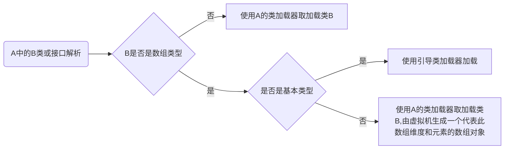
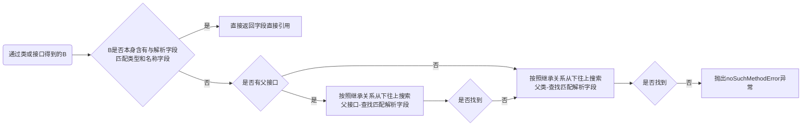

# 前言
C/C++编译器所有优化在编译器期间完成，运行期间性能监控仅作为基础优化措施。在java语言里面，jvm把类的数据从class文件加载到内存，并对数据进行校验，转换解析，初始化；而在类型的加载，连接，初始化过程都是在程序运行期间完成的，这种方式提高了应用程序的灵活性。

类的生命周期

整个过程**除了解析**阶段，其他阶段都是**相互交叉混合的执行**，通常会在一个阶段执行过程中调用，激活另一个阶段

**必须立即对类进行“初始化”情况**

jvm规范规定下面几种情况必须立即对类进行初始化

- 遇到**new**，get**static**，putstatic，invokestatic这四条指令时，如果类未初始化则进行初始化；**代码场景**：new 关键字实例化对象；读取设置一个static字段（同时final，static修饰常量外，final修饰常量在编译阶段就把放入常量池中了），调用一个static修饰方法
- 使用**反射**对类进行反射调用的时候
- 对**子类**的初始化必先对**父类**进行初始化
- 虚拟机启动，执行**程序入口方法**类先初始化
- 当使用java动态特性，使用**methodHandle**实例进行方法入参调用时，代表的引用后面的类要先于使用前得到初始化

接口的初始化大致和类一致，在对**父接口初始化**的时候，不要求父接口全部完成初始化，只是在真正使**用到父接口的时候才会初始化**。

# 类加载过程

## 加载

加载过程分为三个过程

- 通过一个**类的全限定名**获取定义此类的**二进制字节流**。
- 将这个字节流代表的**静态存储结构**转化为**方法区运行时结构**
- 在内存中**生成**一个代表这个类的**class对象**，**作为**方法区这个类各种数据的**访问入口**

第一步，获取二进制流可以通过很多方式进行获取，jar，war，ear包，网络，代理都可以获取

**数组**类型类加载时，如果组件类型是**引用类型**，则会使用该**组件类型的类加载器**进行加载；如果是**基本类型**，则会使用**引导类加载器**进行加载

## 验证

Java虚拟机只与Class文件这种特定的二进制文件格式所关联，使用java语言编写代码会在编译的时候对数组边界，类型转换，跳转等代码进行验证，但是如果是采用其他语言编写，编译成class文件就有可能没有经过一定的验证，造成载入系统奔溃的代码。

主要验证动作

- **文件格式**验证，验证字节流是否符合**class文件格式**的规范，并且能被当前版本虚拟机处理。详见[java类文件结构](http://yatesblog.oss-cn-shenzhen.aliyuncs.com/2018/03/12/calss-structure.html)
- **元数据**验证，对字节码描述的信息进行语义分析，使其符合**java语言规范**的要求，是否可**继承，抽象**类格式，接口格式等等。
- **字节码**验证，通过数据流和控制流，分析程序的**语义是否合法**，符合逻辑，比如**跳转**区域，**存取值类型**。
- **符号引用**验证，发生在虚拟机将符号引用转换为直接引用时，对自身类以外的信息进行匹配性校验（符号引用**是否找得到对应类，引用字段，方法**是否在对应类中有定义以及**访问标志**是否合法）

## 准备

主要是为**类变量分配内存**并初始化值，这里指的初始化是指**基本类型的初始化**，都是该数据类型零值。（final修饰常量为指定的常量值）

## 解析

主要是将常量池中**符号引用替换为直接引用**。
- 符号引用，编译时，Java类并不知道所引用类实际地址，在类文件结构中存储在表中，描述所引用的目标，跟虚拟机实现的内存布局无关，包括**类和接口，方法，成员变量**引用
- 直接引用：跟虚拟机实现的内存布局有关，引用的目标必定已在内存中。

虚拟机实现根据需求判断是在类加载时进行解析，还是等到被使用前才进行解析。
解析动作主要针对类或接口，字段，类方法，接口方法，方法类型，方法句柄和调用点限符进行符号引用。

### **类或接口的解析**

以当前代码所处D类中，要把一个从未解析过的符号N解析为一个类或接口C的直接引用。
- 如果C**不是数组类型**，把N的**全限定类型**传递给D的类加载器去加载类C，加载期间，会经历前面所有的元数据验证，字节码验证，父类加载等一些列动作。
- 如果数组C是一个数组类型，而且组件类型非基本类型，那么在经过和前面一样的规则加载组件类型的类，然后由虚拟机生成一个代表此数组维度和元素的数组对象。
- 经过上面的步骤，C在虚拟机中已经是一个有效的接口或类了，接下来符号引用验证访问权限

类或接口解析



### **字段解析**

字段解析会经过对**字段所属的类或接口**进行解析，得到C，完成后进行下面步骤：

- 如果C本身包含简单名称和字段描述符和解析字段相匹配，则直接返回这个字段直接引用。
- 上述若不成立，如果在C中实现了接口，则会按照继承关系从下往上递归搜索各个接口和父接口，直到找到简单名称和字段描述符和解析字段相匹配字段，返回这个字段直接引用。
- 如果接口查找不到，则按照继承关系从下往上递归搜索其父类
- 若还是没有找到，则抛出异常。

同样会对返回引用进行权限验证。


字段解析



**如果同名字段同时出现在C的接口，父类中或同时在自己和父类多个接口中出现，编译器会拒绝编译**

### **类方法解析**

**和字段解析一样**，需要先解析出方法所属类或接口的符号引用，解析完成，得到C，然后进行下面步骤：

- 类方法和接口方法的符号引用的常量类型定义不一样的，先对C引用进行**验证是否是一个类引用**
- 通过第一步后，在**类C中查找**是否有简单名称和描述符相匹配的方法，**有则返回直接引用**
- 若在类C中**没有找到**匹配方法，则在**父类中递归查找**具有匹配的方法，**有则返回直接引用**
- 若在父类中**没有找到**匹配方法，则在类C实现的接口列表和这些**接口的父接口递归查找**，如果**有**，说明类C是一个抽象类，**抛出AbstractMethodError异常**
- 否则，抛出noSuchMethodError异常

当然最后会对该方法引用进行权限验证

### **接口方法解析**

**和类方法解析一样**，先解析出方法所属类或接口的符号引用，解析完成，得到C，然后进行下面步骤：

- 和类方法解析第一步一样，不过是对C引用验证**是否一个接口引用**
- 通过第一步后，在**接口C中查找**是否有简单名称和描述符相匹配的方法，**有则返回直接引用**
- 若在类C中**没有找到**匹配方法，则在接口C的**父接口递归查找**，查找是否有简单名称和描述符相匹配的方法，**有返回方法直接引用**。
- 否则，抛出noSuchMethodError异常

## 初始化

在初始化阶段，才真正执行类中定义的java程序代码，用另外一种角度表达，这个阶段是**执行类构造器clinit方法**的过程。

- clinit方法收集类中所有 **类变量赋值**动作和**静态语句块**，**静态方法**中语句，合并产生
- 收集顺序取决于语句在**源文件中出现的顺序**，static代码块中对于在它之后定义的变量，可以复制，但是不能访问。
- clinit方法和init方法一样都会**先初始化相应的父类方法**
- 如果是**接口clinit方法**的话，不需要先执行父接口的clinit方法，只有当**父接口**的**变量使用**时，**父接口才会初始化**，接口实现类在初始化也不会执行接口clinit方法。
- 虚拟机会保证clinit方法只被一个线程执行一次，且**只被执行一次**

# 类加载器

类加载器主要实现了在类加载阶段，通过一个**类的全限定名**来**获取类的二进制字节流**，这个实现动作是放到java**虚拟机外部实现**的。
JVM不是启动的时候把所有class文件都加载一遍，而是**用到**的时候**才加载**。每一个类，都需要由加载它的**类加载器和这个类**本身一同**确立**其在java虚拟机中的**唯一性**。

**双亲委派模型**


从java虚拟机角度来看，只存在两种不同类加载器:

- 一种是**启动类加载器**，是虚拟机本身一部分；
- 另一种独立于虚拟机外部，用于加载其他所有类加载器，全部继承抽象类java.lang.classloader

从开发角度来看，可分为以下三种：

- 启动类加载器：负责加载java_home下**lib目录**或**-Xbootclasspath**参数所指定路径中的类库到虚拟机内存中，在开发中返回null可将加载请求委派给引导类加载器
- 扩展类加载器：由sun.misc.Launcher的ExtClassLoader实现，负责加载javahome下**lib\ext目录**中或**java.ext.dirs系统变量**指定路径的类库，该加载器在开发中可被直接使用
- 应用程序类加载器：由sun.misc.Launcher的App-ClassLoader实现，通过classLoader的getsystemclassloader方法得到，也被称为系统类加载器。负责加载**用户类路径**上类库

```java
public abstract class ClassLoader {

    //每个类加载器都有个父加载器
    private final ClassLoader parent;
    
    public Class<?> loadClass(String name) {
  
        //查找一下这个类是不是已经加载过了
        Class<?> c = findLoadedClass(name);
        
        //如果没有加载过
        if( c == null ){
          //先委托给父加载器去加载，注意这是个递归调用
          if (parent != null) {
              c = parent.loadClass(name);
          }else {
              // 如果父加载器为空，查找Bootstrap加载器是不是加载过了
              c = findBootstrapClassOrNull(name);
          }
        }
        // 如果父加载器没加载成功，调用自己的findClass去加载
        if (c == null) {
            c = findClass(name);
        }
        
        return c；
    }
    
    protected Class<?> findClass(String name){
       //1. 根据传入的类名name，到在特定目录下去寻找类文件，把.class文件读入内存
          ...
          
       //2. 调用defineClass将字节数组转成Class对象
       return defineClass(buf, off, len)；
    }
    
    // 将字节码数组解析成一个Class对象，用native方法实现
    protected final Class<?> defineClass(byte[] b, int off, int len){
       ...
    }
}
```

- **defineClass**这个工具方法，调用**native方法**（C语言实现，通过**JNI机制**调用）把java类字节码解析成一个class对象
- findClass主要职责是找到.class文件
- loadClass确定哪个类加载器去加载class文件

类加载器之间并不是继承关系，自定义类加载器只需继承classLoader抽象类，重写findClass和loadClass方法。如果需要**打破双清委派**原则，则需要**重写loadClass**方法

双亲委派模型工作过程是如果一个类加载器收到类加载请求，首先不会自己去尝试加载这个类，而是将加载请求**委派给父类加载器**，如果父类无法加载该请求，才自己去尝试加载。

双亲委派模型确保了java程序的稳定运作，避免了自定义类和基础类由于全限定名的一样导致的关系错乱，保证了java类型体系的行为。

双亲委派模型破坏，程序动态性，osgi，jndi


## 即时编译

从上面我们知道虚拟机中字节码由解释器完成编译，类在调用过程中，执行引擎把字节码转为机器码，然后操作系统才能执行。

为了**提高热点代码执行效率**，运行时,JIT把**代码编译成**本地平台相关**机器码**，优化**保存到内存**中。

### 即时编译器类型

- C1编译器：简单快速特定，关注与**局部性优化**，适用于**执行时间短**或**启动性能**有要求程序
- C2编译器：为长期允许服务器应用程序做性能调优，适用于**执行时间长**或对**峰值性能**有要求程序。

**分层编译**：

Java7引入分层编译

- 0层：程序解释执行，默认开启性能监控功能，若不开启，可触发第二层编译
- 1层：可C1编译，字节码编译为本地代码，进行简单，可靠优化，不开启监控
- 2层：也称为C1编译，开启监控，仅执行带**方法调用次数**和**循环回边执行次数**监控的C1编译
- 3层：也称为C1编译，执行所有带监控的C1编译
- 4层：可称为C2编译，将字节码编译为本地代码，但是启用一些编译耗时长的优化，可能根据性能监控进行一些不可靠激进优化

Java8默认开启分层编译
```java
java -version 可查看当前编译模式
-XX:-tIEREDcOMPILATION // 只想开启C2
-XX:TieredStopAtLevel=1 // 只想开启C1
-Xint // 强制运行只有解释器编译模式
-Xcomp // 强制运行只有JIT编译模式
```

### 热点探测

基于计数器，这种方式虚拟机会为每个**方法**建立计数器，**统计执行次数**，超过一定阙值就认为是热点方法。
	
- **方法调用计数器**：统计方法被调用次数，C1模式默认阙值1500，C2模式默认阙值10000次，-XX:CompileThreshold可设定（分层模式下失效）。
- **回边计数器**：统计一个方法循环体代码执行次数，**字节码遇到控制流向后跳转**称为**回边**，C1模式默认阙值13995，C2模式默认阙值次10700，-XX：OnStackReplacePercentage=N设置；同样，分层模式下会失效。

回边计数器建立是为了触发**OSR编译（栈上编译）**，当代码段循环达到阙值时，JVM会认为这段是热点代码，JIT编译器将代码编译成机器语言并缓存。


### 编译优化技术

**方法内联**

调用方法通常要压栈和出栈，将程序执行顺序转移到存储该方法内存地址，执行完后再返回调用现场（方法调用产生时间和空间开销）。内联就是把**目标方法代码复制到发起调用的方法**中，避免发生正式方法调用

如果方法体太大，JVM将不会做内联优化，可通过如下设置：

```java
- XX:MaxFreqInlineSize=N：经常执行方法，默认325byte
- XX:MaxInlineSize=N：不经常使用执行方法，默认35byte

-XX:+PrintCompilation //在控制台打印编译过程信息
-XX:+UnlockDiagnosticVMOptions //解锁对JVM进行诊断的选项参数。默认是关闭的，开启后支持一些特定参数对JVM进行诊断
-XX:+PrintInlining //将内联方法打印出来
```

提高方法内联

- 设置JVM参数减少，增加阙值
- 避免大方法体
- 尽量使用final、private、static关键字修饰方法，编码方法因为继承，会需要额外的类型检查。

**逃逸分析与栈上分配**

判断一个对象**是否被外部方法引用**或**外部线程访问**的分析技术，在堆中创建，销毁一个对象要比在栈上创建，销毁来说，更消耗时间和性能，**逃逸分析**对象**只会在方法中使用**，就会将对象分配到栈上。**HotSpot**暂时**没有实现**该优化

**锁消除**

StringBuffer和StringBuider一个线程安全，一个线程不安全容器，但是JIT编译会判断是否只在局部方法中创建只能被当前线程访问，进行这个**对象方法的锁消除**

**标量替换**

逃逸分析证明一个**对象不会被外部访问**，如果对象可拆分，程序执行时可能**不创建这个对象**，而直接**创建成员变量**来进行**代替**，**分配成员变量直接在寄存器和栈上**，原本对象无需分配内存空间。


```java
-XX:+DoEscapeAnalysis开启逃逸分析（jdk1.8默认开启，其它版本未测试）
-XX:-DoEscapeAnalysis 关闭逃逸分析

-XX:+EliminateLocks开启锁消除（jdk1.8默认开启，其它版本未测试）
-XX:-EliminateLocks 关闭锁消除

-XX:+EliminateAllocations开启标量替换（jdk1.8默认开启，其它版本未测试）
-XX:-EliminateAllocations 关闭就可以了
```

**Class.forName和ClassLoader.loadClass**

前者加载.class文件到jvm中，对类进行解释，执行类中static块，静态变量赋值，重载方法可以指定是否需要初始化；后者只加载.class文件到jvm中


